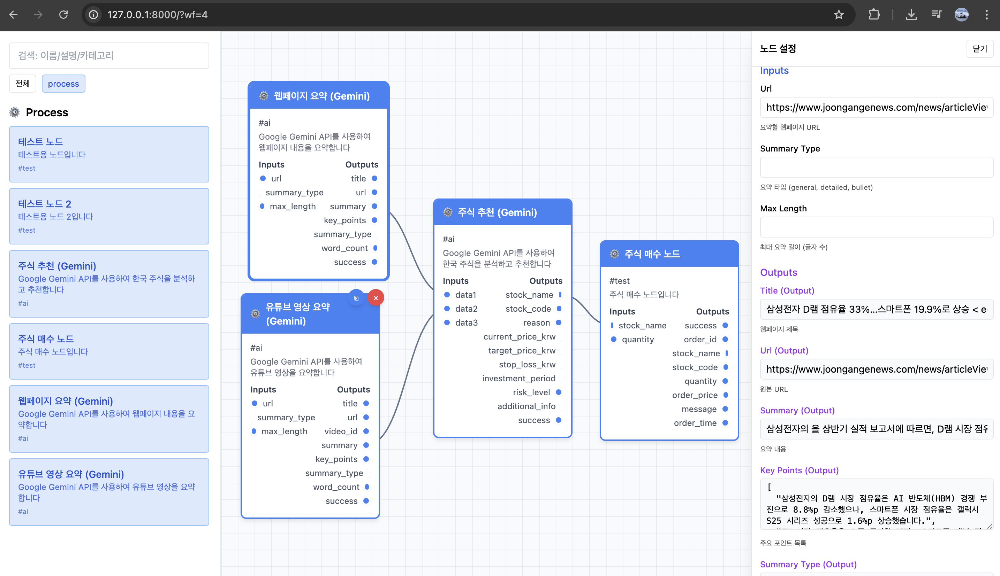

# AI 기반 주식 투자 워크플로우

## 프로젝트 소개

증권사들이 Open API를 제공하기 시작한 시점에서, 인공지능을 활용한 주식 투자 자동화 플랫폼을 실험적으로 구현했다. ComfyUI와 유사한 노드 기반 워크플로우 편집기를 제공하며, Google Gemini를 이용해 시장 분석부터 의사결정, 주문 실행까지 하나의 흐름으로 구성할 수 있다.

## 주요 기능

### 비주얼 노드 에디터

- 드래그 앤 드롭으로 워크플로우 구성
- 연결 관계를 통한 데이터 흐름 시각화
- 다중 선택 및 단축키 지원

### AI 분석 노드

- 주식 추천(Gemini): 입력 데이터를 바탕으로 종목 추천
- 웹페이지 요약: 뉴스와 리포트 텍스트 요약
- 유튜브 영상 요약: 영상 링크 기반 요약
- 실시간 매매: 한국투자증권 API를 통한 주문 실행

### 개발자 친화적 구조

- 노드 시스템: 기능 추가가 쉬운 확장형 아키텍처 (원하는 기능이 있을 시 nodes에 BaseNode를 상속받아서 구현하면 됨)
- 데이터 전파: 연결된 노드 간 값 변경 자동 반영
- 실행 히스토리: 실행 결과 이력 관리

## 기술 스택

### Backend

- Django 5.2.5
- Python 3.13
- uv (패키지 관리)
- Pydantic (데이터 검증)

### Frontend

- 순수 JavaScript (의존성 최소화)
- Tailwind CSS
- HTML5 Canvas

### AI & APIs

- Google Gemini 2.5 Flash (google-genai)
- 한국투자증권 KIS API
- BeautifulSoup4 (크롤링)

## 아키텍처 개요

### 노드 시스템

```python
class BaseNode:
    """모든 노드의 기본 클래스"""
    def execute(self, data) -> result:
        # 각 노드의 실행 로직
        pass
```

- 확장 가능한 설계: 새로운 노드 타입을 쉽게 추가
- 타입 안전성: Pydantic 모델을 통한 입출력 검증
- 예외 처리: 공통 처리 경로에서 일관성 유지

### 데이터 흐름

```javascript
// 노드 간 데이터 전파 시스템
propagateConnectionData(fromNode, toNode) {
    // 연결된 노드들에게 자동으로 데이터 전달
}
```

## 기술 선택 배경

### 증권사 API 비교

| 구분        | 한국투자증권 | 키움증권    | 대신증권               |
| ----------- | ------------ | ----------- | ---------------------- |
| API 방식    | RESTful API  | RESTful API | COM/OCX (Windows 전용) |
| 플랫폼 지원 | OS 독립      | OS 독립     | Windows 전용           |
| 해외 주식   | 지원         | 미지원      | 미지원                 |
| 개발자 경험 | 높음         | 중상        | 낮음                   |

Legacy COM/OCX API는 과거 Windows 환경의 표준이었던 기술로써 이는 응용 프로그램 간의 상호작용을 위해 설계되었으며, 증권사 HTS(Home Trading System)의 기능을 외부 프로그램에서 호출할 수 있게 만든다.

즉 윈도우 환경에서 HTS를 켜두면 이를 다른 프로그램이 제어하는 형식으로 환경에 제약을 받는다.
이에 RESTful API를 제공하지 않는 api는 사용하지 않았다.

이중 한국투자증권이 예시 코드도 제공해주고, 편리해보여 선택했다.

### AI 라이브러리

- Google Gemini: 최신 `google-genai` 패키지 사용
- 멀티모달 지원: 텍스트/이미지/비디오 처리
- 한국어 처리 성능 양호

### 커스텀 노드 에디터

기성 라이브러리(Rete.js, LiteGraph.js, Drawflow)는 기능 과다와 커스터마이징 제약이 있었다. 성능과 제어를 위해 순수 JavaScript로 직접 구현했다.

## 구현된 코드 설명

### GeminiNode

env에 GEMINI_API_KEY를 설정했다면

```
from google import genai

client = genai.Client()
response = client.models.generate_content(
    model='models/gemini-2.5-flash',
    contents="your contents"
)
```

와 같이 간편하게 사용할 수 있다.

응답을 json형식으로 받고 싶다면
아래와 같이 프롬프트를 구성하면 유용하다.

```
응답은 반드시 다음 JSON 형식으로만 제공해주세요:
{{
    "stock_name": "회사명",
    "stock_code": "종목코드",
    "reason": "구체적인 추천 이유 (최소 100자)",
    "current_price_krw": 현재가격,
    "target_price_krw": 목표가격,
    "stop_loss_krw": 손절가격,
    "investment_period": "단기/중기/장기",
    "risk_level": "낮음/중간/높음",
    "additional_info": "주의사항 및 추가 정보"
}}

```

### GeminiSummaryNode

BeautifulSoup을 사용하면 대략적으로 필요한 정보만을 빠르게 추출할 수 있고,
이를 gemini를 사용해 정제한다면 아주 쉽게 크롤링을 할 수 있다.

```python
response = requests.get(url, headers=headers, timeout=10)

soup = BeautifulSoup(response.content, 'html.parser')

# 불필요한 태그 제거
for tag in soup(['script', 'style', 'nav', 'header', 'footer', 'aside']):
    tag.decompose()

# 적당히 본문 찾기
content_selectors = [
    'main', 'article', '.content', '.post', '.entry',
    '#content', '#main', '.main-content'
]
content_text = ""
for selector in content_selectors:
    content = soup.select_one(selector)
    if content:
        content_text = content.get_text()
        break
```

### YoutubeNode

```python
response = client.models.generate_content(
    model='models/gemini-2.5-flash',
    contents=genai.types.Content(
        parts=[
            genai.types.Part(
                file_data=genai.types.FileData(file_uri=data.url),
            ),
            genai.types.Part(text=prompt_text)
        ]
    )
)
```

위와같이 유튜브 영상의 링크를 file로 넘기면 영상을 사용한 질의가 가능하다.

### StockBuyNode

한국 투자증권의 api를 사용하기 위해선 먼저 한국 투자증권 계좌를 개설해야 한다.

이후 [공식 홈페이지](https://apiportal.koreainvestment.com/intro)에 접속해서 오른쪽 위의 api신청을 하면 사용할 수 있게 된다.

기본적으로 api 사용시 6자의 축양된 종목 코드를 사용하게 되는데 이는
[종목정보파일](https://apiportal.koreainvestment.com/apiservice-category)을 받아서 사용해야한다.

[샘플코드](https://github.com/koreainvestment/open-trading-api/blob/main/stocks_info/kis_kospi_code_mst.py)를 제공하는데 파일이 cp949를 사용하므로 주의하자.

특히 윈도우 환경이 아닌경우 더

인증은 공식 예제의 [kis_auth.py](https://github.com/koreainvestment/open-trading-api/blob/main/examples_user/kis_auth.py)를 가져다가 사용하면 되며, 이경우 [kis_devlp.yaml](https://github.com/koreainvestment/open-trading-api/blob/main/kis_devlp.yaml)을 작성해야 한다.

이후 [국내 주식 예제](https://github.com/koreainvestment/open-trading-api/blob/main/examples_user/domestic_stock/domestic_stock_examples.py)만 봐도 얼추 할 수 있다.

예제의 [domestic_stock_functions.py](https://github.com/koreainvestment/open-trading-api/blob/main/examples_user/domestic_stock/domestic_stock_functions.py)를 사용하면 아래처럼 쉽게 구현이 가능하다.

```python
buy_result = order_cash(
    env_dv="demo",  # 모의투자
    ord_dv="buy",   # 매수
    cano=trenv.my_acct,
    acnt_prdt_cd=trenv.my_prod,
    pdno=stock_code,
    ord_dvsn="01",  # 지정가
    ord_qty=str(quantity),
    ord_unpr="0",   # 시장가 (0으로 설정)
    excg_id_dvsn_cd="KRX"
)
```

## 기술적 이슈와 해결

### 1) 문자 인코딩

KIS 종목 데이터 파일이 CP949 인코딩이다. 안전한 디코딩을 위해 명시적으로 처리했다.

```python
with open(file_name, mode="r", encoding="cp949", errors="ignore") as f:
```

### 2) 라이브러리 마이그레이션

구버전 `google-generativeai` 대신 최신 `google-genai`로 전환했다.

```python
# Before (Legacy)
import google.generativeai as genai
genai.configure(api_key=api_key)

# After (Modern)
from google import genai
client = genai.Client(api_key=api_key)
```

### 3) 데이터 동기화

여러 노드가 연결된 상태에서 데이터 일관성을 유지하기 위해 이벤트 기반 전파를 구현했다.

## 스크린샷


드래그 앤 드롭으로 워크플로우를 구성하는 화면.

## 로컬 실행 방법

```bash
# 1) 저장소 클론
git clone https://github.com/hd1534/py-stock
cd py-stock

# 2) 의존성 설치
uv install

# 3) 환경 변수 설정
cp .env.example .env
# GEMINI_API_KEY 등 필요한 키 설정

# 4) 서버 실행
uv run python manage.py runserver
```

애플리케이션은 `http://localhost:8000`에서 확인할 수 있다.

## 추후 계획

ci/cd구축해 서버에 띄울 예정이며, 안전한 인증을 위해 구글 oauth를 붙일 생각이다.

추가로 워크플로우를 저장해 일정 주기마다 실행 가능하게 스케쥴링을 할 생각이다.
